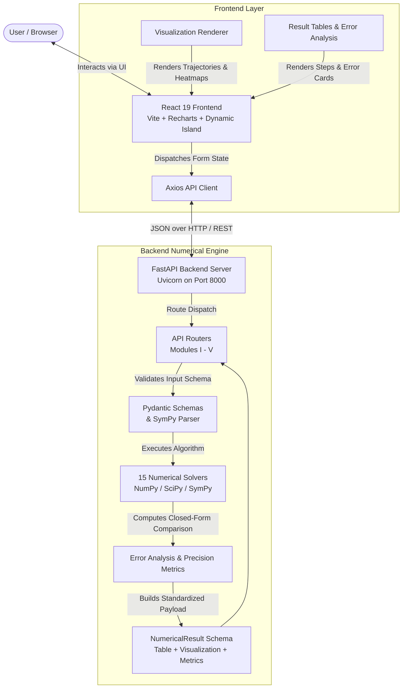

# NumeriLab — Interactive Numerical Methods Analysis & Visualization Platform

[](file:///d:/NumeriLab/backend/tests)
[](https://fastapi.tiangolo.com)
[](https://react.dev)
[](https://vitejs.dev)

> **NumeriLab** is an interactive scientific computing and numerical analysis platform designed to bridge academic syllabus theory with real-time computational solvers, dynamic step-by-step convergence tables, closed-form analytical benchmarks, and rich graphical trajectory visualizations.

---

## Overview

NumeriLab provides an end-to-end interactive workbench across **5 syllabus-aligned numerical modules** and **15 standardized numerical methods**. It couples a high-performance **Python (FastAPI, NumPy, SciPy, SymPy)** computational backend with a modern **React (Vite, Recharts, Dark Glassmorphism)** user interface.

Every numerical solver provides:
- **Parameter Validation & Presets:** Dynamic input configurations with safe SymPy mathematical expression parsing.
- **Granular Iteration Records:** Full tabular tracking of intermediate steps, states, slopes, relaxation values, and interval subdivisions.
- **Analytical Error Benchmarks:** Automatic evaluation of absolute error ($|x_{\text{num}} - x_{\text{exact}}|$), relative error ($\%$), and convergence order against closed-form analytical solutions.
- **Rich Visualizations:** Responsive line plots, convergence curves, multi-segment spline trajectories, space-time temperature evolutions, and 2D finite-difference heatmaps.

---

## Key Features

- **Interactive Solver Workbenches:** Tailored input forms with mathematical expression support (`^` and `**` normalization), interval bounds, tolerance targets, and preset benchmark problems.
- **Dynamic Island-Style Floating Navigation:** Morphing glass navigation bar with smooth scroll-aware transitions and zero content overlap.
- **Modular Floating Course Drawer:** Rapid access to all 5 core modules and solvers from anywhere in the application.
- **Restructured Workspace Layout:** Clean desktop row pairing *Input Parameters* with *Solution Summary*, followed by full-width *Interactive Visualizations*, *Accuracy & Error Analysis*, and *Step-by-Step Iteration Tables*.
- **Comprehensive Visual Canvas:**
  - Function & Root Trajectories (Secant, Fixed-Point)
  - Polynomial & Piecewise Spline Curves (Lagrange, Cubic Splines)
  - Quadrature Partition Overlays (Trapezoidal, Simpson, Romberg)
  - Initial Value ODE Stepping Fields (Euler, Modified Euler, RK4)
  - 1D Space-Time Heat Diffusion Profiles (Crank-Nicolson)
  - 2D Boundary Value & Potential Field Heatmaps (Laplace/Poisson, Linear BVP)
- **100% Automated Backend Test Coverage:** 102/102 automated unit and integration tests verifying numerical correctness and schema contracts across all 15 methods.

---

## Modules and Numerical Methods

NumeriLab implements 15 classical and modern numerical methods across 5 modules:

### Module I — Solution of Equations & Linear Systems
| # | Method | Endpoint | Description |
|---|---|---|---|
| 1 | **Fixed Point Iteration** | `POST /api/module1/fixed-point` | Iterative root-finding using rearranged form $x = g(x)$ with convergence diagnostics. |
| 2 | **Secant Method** | `POST /api/module1/secant` | Superlinear root-finding using finite-difference secant lines without analytical derivatives. |
| 3 | **Gauss-Seidel Method** | `POST /api/module1/gauss-seidel` | Iterative solver for linear algebraic systems ($A\mathbf{x} = \mathbf{b}$) with immediate coordinate updates. |

### Module II — Interpolation & Approximation
| # | Method | Endpoint | Description |
|---|---|---|---|
| 4 | **Lagrange Interpolation** | `POST /api/module2/lagrange` | Construct degree $(n-1)$ interpolating polynomials passing through discrete data pairs. |
| 5 | **Lagrange Inverse Interpolation** | `POST /api/module2/inverse-lagrange` | Estimate the argument $x$ corresponding to a target function value $y^*$. |
| 6 | **Cubic Spline Interpolation** | `POST /api/module2/cubic-spline` | Piecewise $C^2$-continuous natural cubic spline formulation across data knots. |

### Module III — Numerical Integration
| # | Method | Endpoint | Description |
|---|---|---|---|
| 7 | **Trapezoidal Rule** | `POST /api/module3/trapezoidal` | Composite 2-point linear Newton-Cotes numerical quadrature with $O(h^2)$ global error. |
| 8 | **Simpson's 1/3 Rule** | `POST /api/module3/simpson` | Composite parabolic Newton-Cotes quadrature with $O(h^4)$ global error over even subintervals. |
| 9 | **Romberg Integration** | `POST /api/module3/romberg` | Successive Richardson extrapolation applied to trapezoidal approximations with triangular tableau. |

### Module IV — Ordinary Differential Equations
| # | Method | Endpoint | Description |
|---|---|---|---|
| 10 | **Euler's Method** | `POST /api/module4/euler` | Explicit first-order forward difference stepping for initial value problems ($y' = f(x, y)$). |
| 11 | **Modified Euler's Method** | `POST /api/module4/modified-euler` | Second-order Heun predictor-corrector scheme using trapezoidal slope averaging. |
| 12 | **Fourth-Order Runge-Kutta (RK4)** | `POST /api/module4/rk4` | High-precision $O(h^4)$ four-stage trial slope quadrature for initial value differential equations. |

### Module V — Boundary Value Problems & Partial Differential Equations
| # | Method | Endpoint | Description |
|---|---|---|---|
| 13 | **Two-Point Linear BVP** | `POST /api/module5/linear-bvp` | Second-order finite difference solver for $y'' + p(x)y' + q(x)y = r(x)$ supporting Dirichlet and Robin conditions. |
| 14 | **2D Laplace/Poisson Equation** | `POST /api/module5/laplace-poisson` | Five-point discrete finite-difference grid relaxation solver for steady-state potential and diffusion fields. |
| 15 | **Crank-Nicolson 1D Heat Equation** | `POST /api/module5/crank-nicolson` | Implicit, unconditionally stable space-time finite-difference scheme with tridiagonal matrix inversion. |

---

## Technology Stack

### Frontend
- **Framework:** React 19 + JavaScript (ESNext)
- **Bundler & Tooling:** Vite 8
- **Charting & Data Visualization:** Recharts 3
- **HTTP Client:** Axios
- **Styling Architecture:** Pure Vanilla CSS (Custom Design System with Dark Glassmorphism, CSS Custom Properties, and Dynamic Island morphing transitions)

### Backend
- **Framework:** FastAPI (Python 3.11+)
- **Numerical & Scientific Engine:** NumPy, SciPy, SymPy
- **Data Validation & Serialization:** Pydantic v2
- **ASGI Server:** Uvicorn
- **Testing:** Pytest

---

## System Architecture



---

## Project Structure

```text
NumeriLab/
├── backend/
│   ├── api/                      # FastAPI route controllers for Modules I–V
│   │   ├── module1.py
│   │   ├── module2.py
│   │   ├── module3.py
│   │   ├── module4.py
│   │   └── module5.py
│   ├── core/                     # Reusable models, schemas, and expression parsers
│   │   ├── expression.py
│   │   └── schemas.py
│   ├── methods/                  # Core numerical method algorithmic implementations
│   │   ├── module1/              # Fixed-Point, Secant, Gauss-Seidel
│   │   ├── module2/              # Lagrange, Inverse Lagrange, Cubic Spline
│   │   ├── module3/              # Trapezoidal, Simpson, Romberg
│   │   ├── module4/              # Euler, Modified Euler, RK4
│   │   └── module5/              # Linear BVP, Laplace/Poisson, Crank-Nicolson
│   ├── tests/                    # 102 automated Pytest verification test suites
│   │   ├── test_module1.py
│   │   ├── test_module2.py
│   │   ├── test_module3.py
│   │   ├── test_module4.py
│   │   └── test_module5.py
│   ├── main.py                   # FastAPI application initialization & CORS config
│   └── .venv/                    # Python virtual environment
├── frontend/
│   ├── src/
│   │   ├── components/
│   │   │   ├── methods/          # Controlled input forms for all 15 methods
│   │   │   ├── results/          # ResultTable, ErrorAnalysis, formatters
│   │   │   ├── visualization/    # Canvas plots, heatmaps, convergence charts
│   │   │   ├── Navbar.jsx        # Dynamic Island floating navigation bar
│   │   │   ├── Sidebar.jsx       # Floating course navigation drawer
│   │   │   ├── ModuleCard.jsx    # Dashboard course module card
│   │   │   ├── MethodCard.jsx    # Method selection card
│   │   │   └── NumeriLabLogo.jsx # Geometric vector numerical orbit logo
│   │   ├── pages/
│   │   │   ├── Dashboard.jsx     # Landing dashboard & module overview
│   │   │   ├── ModulePage.jsx    # Dedicated individual module workspace
│   │   │   └── MethodPage.jsx    # 4-tier structured method workbench
│   │   ├── services/
│   │   │   └── api.js            # Axios client functions for all 15 solvers
│   │   ├── data/
│   │   │   └── methods.js        # Syllabus metadata and route mappings
│   │   ├── App.jsx               # Root application layout & state coordinator
│   │   ├── App.css               # Design system & glassmorphism layout rules
│   │   └── index.css             # CSS design tokens & base resets
│   └── package.json
└── README.md
```

---

## Installation & Setup

### Prerequisites
- **Node.js** (v18.0.0 or higher) and **npm**
- **Python** (v3.11 or higher)

---

### 1. Backend Setup (FastAPI)

Open a terminal (PowerShell / Command Prompt on Windows):

```powershell
# Navigate to backend directory
cd D:\NumeriLab\backend

# Create and activate Python virtual environment
python -m venv .venv
.venv\Scripts\activate

# Install required dependencies
pip install fastapi uvicorn numpy scipy sympy pydantic pytest httpx

# Start the FastAPI development server
uvicorn main:app --reload --host 127.0.0.1 --port 8000
```

The backend server will be live at:
- **API Base:** [http://127.0.0.1:8000](http://127.0.0.1:8000)
- **Interactive Swagger Documentation:** [http://127.0.0.1:8000/docs](http://127.0.0.1:8000/docs)
- **Health Check Endpoint:** [http://127.0.0.1:8000/api/health](http://127.0.0.1:8000/api/health)

---

### 2. Frontend Setup (React + Vite)

Open a second terminal:

```powershell
# Navigate to frontend directory
cd D:\NumeriLab\frontend

# Install dependencies
npm install

# Start the Vite development server
npm run dev
```

The frontend application will be live at:
- **Application URL:** [http://localhost:5173](http://localhost:5173)

---

## Testing

NumeriLab includes a comprehensive test suite across all 15 methods covering mathematical correctness, edge cases (e.g. division-by-zero guards, diagonal dominance, non-convergence handling), and API schema contracts.

To execute the backend automated test suite:

```powershell
cd D:\NumeriLab\backend
.venv\Scripts\pytest -v
```

### Verification Status
```text
============================= test session starts =============================
platform win32 -- Python 3.13.7, pytest-9.1.1, pluggy-1.6.0
collected 102 items

tests/test_module1.py ...................                                [ 18%]
tests/test_module2.py .....................                              [ 39%]
tests/test_module3.py .....................                              [ 59%]
tests/test_module4.py ...................                                [ 78%]
tests/test_module5.py ......................                             [100%]

============================= 102 passed in 3.55s =============================
```

To run frontend linting and production bundle builds:

```powershell
cd D:\NumeriLab\frontend
npm run lint
npm run build
```

---

## Example Usage Flow

1. **Explore Modules:** Launch the platform and view all 5 core syllabus modules directly on the **Dashboard** or open the **`☰ Modules`** drawer to jump to any module.
2. **Launch a Solver Workbench:** Select any method (e.g. *Fourth-Order Runge-Kutta (RK4)* under Module IV).
3. **Configure Parameters:** Enter ODE $f(x, y) = x + y$, initial condition $x_0 = 0, y_0 = 1$, target $x_{\text{end}} = 2$, step size $h = 0.2$, and analytical reference $y(x) = 2e^x - x - 1$.
4. **Execute:** Click **Execute Solver**.
5. **Inspect Solutions:**
   - **Solution Summary:** View computed value ($y(2) \approx 11.7781$), steps taken ($10$), and convergence status.
   - **Interactive Visualization:** Observe the numerical solution trajectory plotted against the analytical benchmark curve.
   - **Accuracy & Error Analysis:** Inspect absolute error ($|E| \approx 1.25 \times 10^{-5}$) and relative error ($\approx 0.0001\%$).
   - **Step-by-Step Table:** Scroll through the detailed $k_1, k_2, k_3, k_4$ trial slopes and intermediate states.

---

## Screenshots

> *Screenshots can be added here after deployment or final capture.*

---

## Future Scope

- **Additional Numerical Solvers:** Integration of higher-order multi-step ODE methods (Adams-Bashforth-Moulton), nonlinear system solvers (Newton-Raphson for systems), and hyperbolic PDE schemes (Wave Equation).
- **Export & Report Generation:** One-click export of step-by-step iteration logs and error charts to PDF, CSV, and LaTeX tables.
- **Extended SciPy Benchmark Suite:** Automated real-time performance and execution timing comparisons against SciPy baseline routines.
- **Cloud Deployment:** Containerized deployment configurations (Docker, AWS/GCP, or Vercel + Render).

---

## Contributors

- **Prewal** ([@Prewal137](https://github.com/Prewal137)) — Lead Developer & Numerical Engine Architect

---

## License

This project is developed for educational and academic engineering applications.
