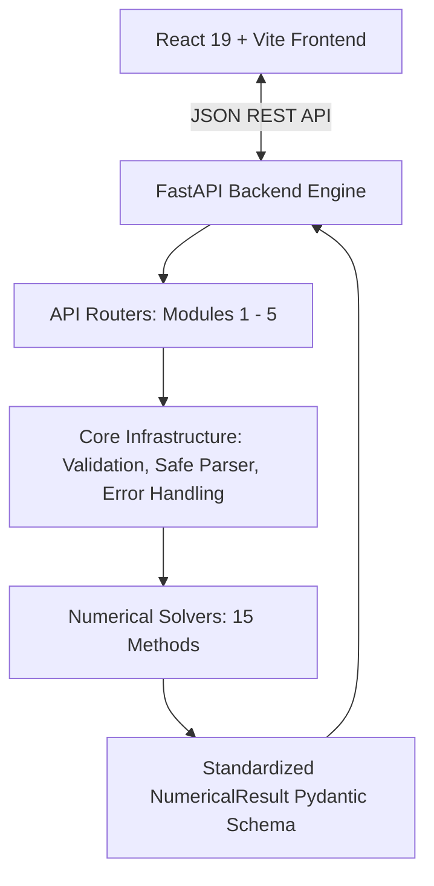

# NumeriLab Architecture Specification

## 1. Project Purpose
**NumeriLab** is an interactive numerical methods analysis and visualization platform. It connects a modern React frontend with a high-performance Python/FastAPI computational backend to solve, visualize, analyze, and benchmark 15 numerical algorithms across 5 core modules.

---

## 2. High-Level System Architecture



---

## 3. Five Numerical-Method Modules

| Module | Category | Methods Included |
| :--- | :--- | :--- |
| **Module I** | Solution of Equations & Linear Systems | 1. Fixed Point Iteration<br>2. Secant Method<br>3. Gauss-Seidel Method |
| **Module II** | Interpolation & Approximation | 4. Lagrange Interpolation<br>5. Lagrange Inverse Interpolation<br>6. Cubic Spline Interpolation |
| **Module III** | Numerical Differentiation & Integration | 7. Trapezoidal Rule<br>8. Simpson's 1/3 Rule<br>9. Romberg Integration |
| **Module IV** | Ordinary Differential Equations | 10. Euler's Method<br>11. Modified Euler's Method (Heun)<br>12. Fourth-Order Runge-Kutta (RK4) |
| **Module V** | BVPs & Partial Differential Equations | 13. Two-Point Linear BVP (Finite Difference)<br>14. 2D Laplace/Poisson Equation (5-Point Stencil)<br>15. Crank-Nicolson Method (1D Heat Equation) |

---

## 4. Backend Directory & Module Structure

```
backend/
├── main.py                     # FastAPI application entry point, CORS, root & health routes
├── api/                        # API route definitions
│   ├── __init__.py
│   ├── module1.py              # Endpoints for Module I methods
│   ├── module2.py              # Endpoints for Module II methods
│   ├── module3.py              # Endpoints for Module III methods
│   ├── module4.py              # Endpoints for Module IV methods
│   └── module5.py              # Endpoints for Module V methods
├── core/                       # Core engine infrastructure
│   ├── __init__.py
│   ├── errors.py               # Custom exceptions (ConvergenceError, ValidationError, etc.)
│   ├── parser.py               # Safe mathematical expression parsing via SymPy
│   ├── result.py               # Standardized Pydantic models (NumericalResult, ErrorAnalysis)
│   └── validation.py           # Domain validation rules (intervals, tolerances, matrix shapes)
├── methods/                    # Pure numerical algorithm implementations
│   ├── __init__.py
│   ├── module1/                # fixed_point.py, secant.py, gauss_seidel.py
│   ├── module2/                # lagrange.py, inverse_lagrange.py, cubic_spline.py
│   ├── module3/                # trapezoidal.py, simpson.py, romberg.py
│   ├── module4/                # euler.py, modified_euler.py, rk4.py
│   └── module5/                # linear_bvp.py, laplace_poisson.py, crank_nicolson.py
└── tests/                      # Automated test suite
    ├── __init__.py
    ├── test_module1.py
    ├── test_module2.py
    ├── test_module3.py
    ├── test_module4.py
    └── test_module5.py
```

---

## 5. Standard Result Schema (`backend/core/result.py`)

All numerical solvers produce a uniform `NumericalResult` data contract:

- **`success`** (`bool`): Execution outcome.
- **`method`** (`str`): Identifier of the executed method.
- **`module`** (`int`): Associated module number (1–5).
- **`final_value`** (`Any`): Final calculated value, polynomial, vector, or mesh.
- **`iterations`** (`int`): Iteration count or sub-interval steps.
- **`converged`** (`bool`): Convergence status against configured tolerance.
- **`error`** (`str`): Diagnostic message if calculation failed.
- **`error_analysis`** (`ErrorAnalysis`): Absolute, relative, and benchmark error metrics.
- **`table`** (`List[Dict]`): Step-by-step intermediate iteration history.
- **`visualization`** (`VisualizationPayload`): Series data and labels for frontend charts.
- **`explanation`** (`str`): Pedagogical breakdown and solver commentary.
- **`metadata`** (`Dict`): Method-specific parameters (e.g. relaxation factor, mesh grid spacing).

---

## 6. Frontend Architecture

```
frontend/src/
├── App.jsx                     # Application shell and view controller
├── main.jsx                    # React application bootstrap
├── index.css                   # Global styles and resets
├── components/                 # Reusable UI components
│   ├── Navbar.jsx              # Header branding and navigation tabs
│   ├── Sidebar.jsx             # Module selector navigation
│   ├── ModuleCard.jsx          # Course module card overview
│   └── MethodCard.jsx          # Individual numerical method card
├── pages/                      # Page-level views
│   ├── Dashboard.jsx           # Global system overview & stats
│   ├── ModulePage.jsx          # Module deep-dive and method selector
│   ├── MethodPage.jsx          # Solver workspace (inputs, results, visualizations)
│   └── VerificationPage.jsx    # Analytical benchmarking & cross-validation
├── data/
│   └── methods.js              # Central metadata registry for all 15 methods
├── services/
│   └── api.js                  # Axios client & health check communication
├── charts/                     # Charting components (reserved for visualization phase)
└── methods/                    # Dedicated method configurations & UI helpers
```

---

## 7. Future Visualization Layer

When charting is introduced:
1. Standard chart wrappers will consume `VisualizationPayload` from solver responses.
2. Support will include:
   - 1D Root-finding / curve trajectories & secant/tangent lines
   - Polynomial & spline interpolation curve overlays
   - Quadrature step partitioning & Riemann sums
   - ODE direction fields and solution paths
   - 2D/3D surface and contour plots for PDEs (Laplace, Poisson, Heat equation)
